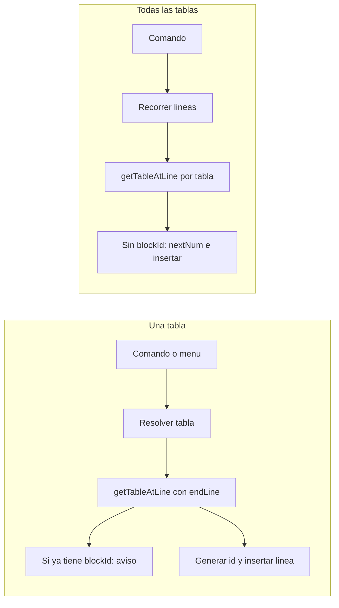

# Plan: Asignar block-id a tablas

## Objetivo

- **Comando 1 – "Asignar block-id a esta tabla"**: formato `{nombre-nota}-tabla-{N}`; disponible en paleta de comandos y en el submenú **Table Tools** del menú contextual (clic derecho sobre la tabla).
- **Comando 2 – "Asignar block-id a todas las tablas de esta nota que no tengan"**: mismo formato; solo en paleta de comandos.

Ambos deben poder ejecutarse desde la paleta. El primero además desde el menú contextual ya existente.

---

## Flujo de datos (resumen)

---

## 1. Exponer límites de tabla en table-detection

**Archivo:** [src/utils/table-detection.ts](src/utils/table-detection.ts)

- **Extender `TableAtCursor`** para incluir `startLine` y `endLine` (ambos `number`). Son las líneas (0-based) de la primera y última fila de la tabla en el editor.
- **En `getTableAtLine`**: además de `rows` y `blockId`, devolver `startLine` y `endLine` en el objeto de retorno (siempre que se devuelva una tabla). Así quien llame sabe dónde insertar la línea `^id` (justo después de `endLine`).

No hace falta cambiar la firma de `getTableIdForMatchingTable` ni `findBlockIdForMatchingTableInDocument`; siguen usando `getTableAtLine` y solo les interesa `blockId`.

---

## 2. Utilidad para nombre de nota y siguiente número

**Archivo nuevo:** `src/utils/block-id.ts` (o dentro de un módulo existente si prefieres agrupar)

- `**sanitizeBasenameForBlockId(basename: string): string`**  
Normalizar el nombre del archivo para que sea un id válido: solo `[a-zA-Z0-9_-]`. Por ejemplo: reemplazar espacios y caracteres no permitidos por `-`, colapsar guiones múltiples, quitar acentos si es necesario. Debe ser consistente con el regex existente en `parseBlockIdLine`: `[a-zA-Z0-9_-]+`.
- `**getNextTableNumberInNote(editor: Editor, sanitizedBasename: string): number`**  
Recorrer todas las líneas del editor y detectar líneas que sean block-id con patrón `^{sanitizedBasename}-tabla-(\d+)$`. Recolectar los números, devolver `max + 1` o `1` si no hay ninguno. Reutilizar la lógica de detección de block-id (p. ej. el mismo regex que en `parseBlockIdLine`, pero con el prefijo fijo).

---

## 3. Comando "Asignar block-id a esta tabla"

**Archivo nuevo:** `src/commands/assign-table-block-id.ts` (o `src/table-actions/assign-block-id.ts`)

- **Entrada:** Mismo patrón que export CSV: desde **comando** (cursor en tabla) o desde **menú contextual** con contexto pre-resuelto.
- **Pasos:**
  1. Obtener editor activo (`getActiveViewOfType(MarkdownView)?.editor`) y, si se llama con contexto del menú, usar ese contexto; si no, resolver con `resolver.resolveForCommand(editor)`.
  2. Obtener archivo activo para el basename (`view.file?.basename ?? "note"`).
  3. Línea a usar: `context.preferredLine ?? editor.getCursor().line`. Llamar a `getTableAtLine(editor, line)`.
  4. Si no hay tabla, aviso y salir.
  5. Si `result.blockId !== null`, mostrar Notice tipo "Esta tabla ya tiene block-id: ^{id}" y salir.
  6. Sanitize del basename; calcular `nextNum = getNextTableNumberInNote(editor, sanitizedBasename)`; construir id `{sanitizedBasename}-tabla-{nextNum}`.
  7. Insertar una línea nueva después de `endLine`: contenido `^id`. Inserción: posición al final de la línea `endLine` (por ejemplo `{ line: endLine, ch: editor.getLine(endLine).length }`) y `editor.replaceRange("\n^" + id, pos)`.
  8. Opcional: Notice "Block-id asignado: ^{id}".

La firma puede ser análoga a `exportTableToCsv(plugin, resolver, context?)` para reutilizar el mismo resolver y el contexto del menú.

---

## 4. Comando "Asignar block-id a todas las tablas de esta nota que no tengan"

**Archivo nuevo:** `src/commands/assign-all-tables-block-id.ts`

- Solo se ejecuta desde **paleta** (no menú contextual).
- **Pasos:**
  1. Editor activo y archivo; si no hay editor, aviso y salir.
  2. Basename sanitizado.
  3. Recorrer el documento por líneas. Para cada línea, llamar a `getTableAtLine(editor, line)`. Si devuelve tabla:
    - Si ya tiene `blockId`, avanzar al siguiente bloque (p. ej. `line = endLine + 1` y seguir; si la siguiente línea es block-id, avanzar una más para no reinterpretar esa línea como inicio de otra tabla).
    - Si no tiene `blockId`, calcular `nextNum = getNextTableNumberInNote(editor, sanitizedBasename)`, construir id, insertar línea después de `endLine` como arriba. Para no alterar índices al insertar, **procesar de abajo hacia arriba** (ordenar las inserciones por `endLine` descendente e insertar en ese orden).
  4. Al final, Notice con cuántas tablas se les asignó block-id (ej. "Block-id asignado a 3 tablas").

Importante: al insertar varias líneas, hacerlo de la última tabla a la primera para que los `endLine` sigan siendo válidos.

---

## 5. Registro en main.ts

**Archivo:** [src/main.ts](src/main.ts)

- **Comando "Asignar block-id a esta tabla":**
  - `addCommand` con `id` estable (p. ej. `assign-table-block-id`), nombre "Asignar block-id a esta tabla", `editorCheckCallback`: si `checking` devolver `cursorIsInTable(editor)`, si no llamar a la función que implementa el comando (pasando plugin, resolver y sin contexto).
  - En el `editor-menu`, dentro del mismo bloque donde ya existe el submenú "Table Tools", añadir un segundo `submenu.addItem` para "Asignar block-id a esta tabla" que al hacer clic llame a la misma función con el `context` ya resuelto (igual que Export table to CSV).
- **Comando "Asignar block-id a todas las tablas de esta nota":**
  - `addCommand` con `id` (p. ej. `assign-all-tables-block-id`), nombre "Asignar block-id a todas las tablas de esta nota que no tengan", `editorCallback` (o `callback` con editor activo): no hace falta `editorCheckCallback` que exija cursor en tabla; si no hay tablas o ninguna sin block-id, la propia lógica del comando puede mostrar un aviso.

---

## 6. Detalles de implementación

- **Inserción de línea:** Obsidian Editor (CodeMirror) acepta `editor.replaceRange(text, from)`. Posición "final de la línea `endLine`": `from = { line: endLine, ch: editor.getLine(endLine).length }`. Texto: `"\n^" + id` para añadir una nueva línea con el block-id.
- **Regex del block-id existente:** En [table-detection.ts](src/utils/table-detection.ts) ya está `parseBlockIdLine`. Para el patrón con prefijo `{basename}-tabla-(\d+)` usar una regex que capture el número y validar que la línea sea solo `^{id}$`.
- **Resolver y preferredLine:** [ResolvedTableContext](src/types.ts) ya tiene `preferredLine`. Cuando el menú contextual pasa contexto, ese `preferredLine` puede no estar definido si la resolución vino por DOM; en ese caso la función "asignar a esta tabla" puede usar el cursor actual o intentar obtener la línea desde el resolver (si en el futuro se expone). Por ahora, si no hay `preferredLine`, usar `editor.getCursor().line` y `getTableAtLine(editor, cursor.line)` devolverá la tabla bajo el cursor.

---

## Resumen de archivos

| Acción                   | Archivo                                                      |
| ------------------------ | ------------------------------------------------------------ |
| Extender tipo y retorno  | [src/utils/table-detection.ts](src/utils/table-detection.ts) |
| Sanitize + next number   | Nuevo: `src/utils/block-id.ts`                               |
| Comando una tabla        | Nuevo: `src/commands/assign-table-block-id.ts`               |
| Comando todas las tablas | Nuevo: `src/commands/assign-all-tables-block-id.ts`          |
| Comandos y menú          | [src/main.ts](src/main.ts)                                   |

---

## Orden sugerido de implementación

1. `table-detection.ts`: añadir `startLine`/`endLine` a `TableAtCursor` y a la devolución de `getTableAtLine`.
2. `block-id.ts`: `sanitizeBasenameForBlockId` y `getNextTableNumberInNote`.
3. `assign-table-block-id.ts`: lógica de un solo comando (resolver tabla, comprobar blockId, generar id, insertar).
4. `assign-all-tables-block-id.ts`: recorrer documento, listar tablas sin id, insertar de abajo a arriba.
5. `main.ts`: registrar ambos comandos y añadir ítem "Asignar block-id a esta tabla" al submenú Table Tools.

