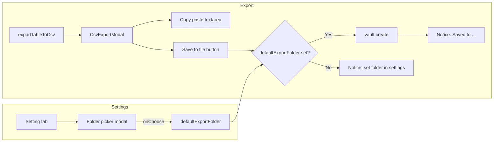

# Default export folder setting

## Scope

- Add a **default export folder** setting (vault-relative path).
- Provide a **folder picker** in the settings UI (user selects a vault folder; path is stored).
- **Export behavior**: Export always opens the existing modal (textarea + "Include table headers" checkbox). Add a **"Save to file"** button in the modal that writes the current CSV content to the default export folder when clicked. If the folder is not set, the button shows a notice asking the user to set it in settings.

## Key files

| File                                                                 | Change                                                                                                                                                                                                                        |
| -------------------------------------------------------------------- | ----------------------------------------------------------------------------------------------------------------------------------------------------------------------------------------------------------------------------- |
| [src/settings.ts](src/settings.ts)                                   | Add `defaultExportFolder: string` to interface and defaults; add folder-picker Setting (text + "Choose folder" button opening a picker modal).                                                                                |
| [src/commands/export-table-csv.ts](src/commands/export-table-csv.ts) | Always open CsvExportModal; pass plugin and view.file so the modal can read settings and derive filename. No branching on folder.                                                                                             |
| [src/ui/csv-export-modal.ts](src/ui/csv-export-modal.ts)             | Add **"Save to file"** button. On click: if defaultExportFolder set, write current CSV (rows + checkbox) to that folder; else show Notice to set folder in settings. Modal needs plugin and optional sourceFile for filename. |
| New: `src/ui/folder-picker-modal.ts`                                 | Modal that lists vault folders (from `vault.getRoot()` traversal), user clicks to select; on select set path and close.                                                                                                       |

## 1. Settings

- **Interface** ([src/settings.ts](src/settings.ts)): Add `defaultExportFolder: string` (default `""`). Keep or remove `mySetting` per your preference (plan keeps it for now).
- **Default**: `defaultExportFolder: ""`.
- **Settings tab**: One new Setting:
  - Description: e.g. "Folder where CSV files are saved when you click 'Save to file' in the export modal."
  - Show current path in a read-only text or a text input.
  - Button **"Choose folder"** that opens the folder picker modal; on choice, set `plugin.settings.defaultExportFolder` to the chosen path and refresh the setting display.
- **Folder picker modal** (new file): Takes `app`, current value, and callback `(path: string) => void`. Renders a list of vault folders (recursive from `app.vault.getRoot()`: traverse `TFolder`, collect paths). User clicks a folder; callback(path); close. Handle root as empty string `""` or `"/"` per Obsidian convention; store as vault-relative (e.g. `Exports` or `Exports/CSV`).

## 2. Export flow and modal button

- **Command** ([src/commands/export-table-csv.ts](src/commands/export-table-csv.ts)): Always open the modal. Call `new CsvExportModal(plugin.app, rows, plugin, view.file).open()` so the modal has plugin (for settings and vault) and source file (for filename).
- **Modal** ([src/ui/csv-export-modal.ts](src/ui/csv-export-modal.ts)):
  - Keep: textarea (copy/paste), "Include table headers" checkbox. Content = `rowsToCsv(rows, includeHeaders)`.
  - Add button **"Save to file"**:
    - If `plugin.settings.defaultExportFolder` is non-empty: get content from current state (e.g. `rowsToCsv(rows, cb.checked)`). Filename: source file basename + `-table.csv`, or `export-table.csv` if no source; if path exists use `-table-1.csv`, etc. Path = `normalizePath(defaultExportFolder + "/" + filename)`. `await plugin.app.vault.create(fullPath, content)`; then Notice "Saved to …".
    - Else: `new Notice("Set default export folder in Settings → Emic Table Tools.")`.
  - Constructor: add `plugin: Plugin` and optional `sourceFile: TFile | null`.

## 3. Folder picker implementation

- **New file** `src/ui/folder-picker-modal.ts`:
  - Extend `Modal`. Constructor: `(app: App, currentPath: string, onChoose: (path: string) => void)`.
  - In `onOpen`: from `app.vault.getRoot()` recurse over `TFolder` children; build a flat or nested list of folder paths (relative to vault). Include the root (empty string) so user can choose "vault root". Render as clickable list; on click call `onChoose(path)` and close.
  - Use `vault.getRoot().path` and each folder’s `.path` for consistency (Obsidian uses `""` for root in some APIs).

## 4. File naming and overwrites

- Use active note name for filename: `const base = view.file?.basename ?? "export";` then `const baseName = base + "-table";`. Check if `folder/baseName.csv` exists; if so try `baseName-1.csv`, `baseName-2.csv`, etc., then `vault.create(normalizedPath, content)`.
- Use `normalizePath` from "obsidian" for path concatenation to avoid double slashes and path issues.

## 5. Data flow

## 6. Edge cases

- **Folder deleted**: If the saved path no longer exists at export time, either create the folder (if API supports) or show a Notice asking the user to choose the folder again in settings.
- **Empty vault / no folders**: Picker can show at least the root option.
- **Include headers**: The saved file uses whatever the checkbox state is in the modal (same as the textarea).

## Summary

| Step | Action                                                                                                                                                                                                                                |
| ---- | ------------------------------------------------------------------------------------------------------------------------------------------------------------------------------------------------------------------------------------- |
| 1    | Add `defaultExportFolder: string` to [MyPluginSettings](src/settings.ts) and DEFAULT_SETTINGS.                                                                                                                                        |
| 2    | Create [src/ui/folder-picker-modal.ts](src/ui/folder-picker-modal.ts): modal listing vault folders, callback with selected path.                                                                                                      |
| 3    | In [SampleSettingTab](src/settings.ts) add Setting with "Choose folder" button that opens FolderPickerModal and updates setting.                                                                                                      |
| 4    | In [CsvExportModal](src/ui/csv-export-modal.ts): add constructor args `plugin` and optional `sourceFile`; add "Save to file" button that writes current CSV (from rows + checkbox) to default export folder or shows notice if unset. |
| 5    | In [export-table-csv.ts](src/commands/export-table-csv.ts): pass plugin and view.file into CsvExportModal; always open modal.                                                                                                         |
| 6    | Use `normalizePath` for paths; handle existing file names with numeric suffix when saving.                                                                                                                                            |

