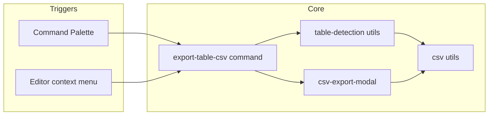

# Export table to CSV (Option B – custom parser)

## Scope

- **In scope**: One feature — export the markdown table at the cursor to CSV. No new dependencies. Parser and CSV logic in-house.
- **Out of scope**: Other table features (format, sort, formulas); settings for CSV (e.g. delimiter); saving CSV to a file (modal + copy is enough for v1).

## Architecture

- **Triggers**: One command (`editorCheckCallback`) + one `editor-menu` handler. Both call the same export flow.
- **Flow**: Get active markdown editor → find table at cursor ([table-detection](#utils-table-detectionts)) → if none, show notice and return; else open [CSV modal](#ui-csv-export-modalts) with the parsed rows. Modal uses [csv utils](#utils-csvts) to produce CSV string (with/without header row).

## File layout

| Path                                                                 | Purpose                                                                                                  |
| -------------------------------------------------------------------- | -------------------------------------------------------------------------------------------------------- |
| [src/main.ts](src/main.ts)                                           | Register command and `editor-menu`; delegate to `commands/export-table-csv`. Remove or slim sample code. |
| [src/commands/export-table-csv.ts](src/commands/export-table-csv.ts) | Run export: get table at cursor, open CSV modal.                                                         |
| [src/utils/table-detection.ts](src/utils/table-detection.ts)         | Parse table at cursor; expose `getTableAtCursor(editor)` and `cursorIsInTable(editor)`.                  |
| [src/utils/csv.ts](src/utils/csv.ts)                                 | `rowsToCsv(rows: string[][], includeHeader: boolean): string` with proper escaping.                      |
| [src/ui/csv-export-modal.ts](src/ui/csv-export-modal.ts)             | Modal: textarea (readonly, select-on-click), "Include table headers" checkbox, refresh on toggle.        |
| [src/settings.ts](src/settings.ts)                                   | Unchanged for now (no CSV settings).                                                                     |
| [manifest.json](manifest.json)                                       | Update `name`, `id`, `description` for Emic Table Tools.                                                 |

No new dependencies; no changes to [esbuild.config.mjs](esbuild.config.mjs) (single entry `src/main.ts` bundles everything).

---

## 1. utils/table-detection.ts

- **Input**: `Editor` from Obsidian.
- **Output**:
  - `getTableAtCursor(editor: Editor): string[][] | null` — full table rows (including header); separator line excluded; `null` if cursor not in a table.
  - `cursorIsInTable(editor: Editor): boolean` — true if current line looks like a table data/header row (not separator).

**Parsing rules (GFM-style)**:

- **Table row**: line that contains at least one `|` and matches pattern like `^\s*\|?.+\|.+\|` (optional leading `|`, cells separated by `|`, optional trailing `|`). Allow empty cells.
- **Separator row**: same structure but cell content is only `-`, `:`, or spaces (e.g. `|---|:---:|---|`). Do **not** include this row in the returned `string[][]`; treat as "cursor in table" for `cursorIsInTable` but skip when building rows.
- **Table boundaries**: Scan upward and downward from the current line while consecutive lines are table rows (or separator). The table is the contiguous block. If the cursor is on a non-table line, return `null` / false.

**Cell extraction**: Split each row line by `|`, trim each segment, remove leading/trailing empty segments from the split (from optional leading/trailing `|`). Strip alignment colons from separator cells when detecting separator; do not store separator content as data.

**Edge cases**: Empty table (e.g. only separator) → return `[]` or `null` as appropriate. Single-column table (e.g. `|a|\n|---|\n|b|`) is valid.

---

## 2. utils/csv.ts

- `**rowsToCsv(rows: string[][], includeHeader: boolean): string`**
  - If `includeHeader` is false and `rows.length > 0`, skip `rows[0]` and export the rest; if true, export all rows.
  - RFC 4180-style: field contains `,` or `"` or newline → wrap in `"`, escape internal `"` as `""`. Join fields with `,`, rows with `\r\n`.
  - Empty `rows` or empty after skipping header → return `""`.

No BOM; encoding is Obsidian’s default (UTF-8) when user copies.

---

## 3. ui/csv-export-modal.ts

- **Constructor**: `(app: App, rows: string[][])` — store `rows`; no editor reference.
- **Content**:
  - Readonly **textarea** showing initial CSV with headers included (`rowsToCsv(rows, true)`). On click, select all (`ta.select()`).
  - **Checkbox** "Include table headers" (default checked). On change, set textarea to `rowsToCsv(rows, cb.checked)`.
- **onClose**: `contentEl.empty()`.
- **Title**: e.g. "Export table to CSV".

Recompute CSV only when checkbox toggles; no need to hold a callback if we keep `rows` in memory.

---

## 4. commands/export-table-csv.ts

- `**exportTableToCsv(plugin: Plugin): void`** (or receive `app` and use `plugin` only for type if needed):
  - Get active view: `app.workspace.getActiveViewOfType(MarkdownView)`; if missing, return.
  - Get `editor` from the view.
  - Call `getTableAtCursor(editor)`. If `null`, `new Notice('Cursor is not in a table.')` and return.
  - `new CsvExportModal(app, rows).open()`.

No file I/O; modal is the only UI.

---

## 5. main.ts

- **Command**: `addCommand` with `id: 'export-table-csv'`, `name: 'Export table to CSV'`, `editorCheckCallback: (checking, editor, view) => { if (checking) return cursorIsInTable(editor); exportTableToCsv(this); return undefined; }`. So the command appears in the palette only when cursor is in a table, and running it performs export.
- **Context menu**: `this.registerEvent(this.app.workspace.on('editor-menu', (menu, editor, view) => { ... }))`. In the callback, if `cursorIsInTable(editor)`, then `menu.addItem((item) => item.setTitle('Export table to CSV').onClick(() => exportTableToCsv(this)))`.
- **Cleanup**: Remove or simplify sample ribbon, status bar, sample commands, and the global click listener/interval so the plugin stays minimal and table-focused. Keep settings tab for now (can be repurposed later).

---

## 6. manifest.json

- Set `id` to a stable plugin id (e.g. `emic-table-tools`).
- Set `name` to "Emic Table Tools" (or desired display name).
- Set `description` to mention table tools and export to CSV.

---

## Testing (manual)

- Create a note with a GFM table; put cursor inside the table; run command or right-click → "Export table to CSV". Modal shows CSV; toggle "Include table headers" and copy.
- Cursor outside table: command not in palette (or disabled); context menu item absent.
- Tables with commas, quotes, newlines in cells: verify CSV escaping in the textarea.
- Edge cases: empty cell, single column, table at start/end of file.

---

## Summary

| Step | Action                                                                                                           |
| ---- | ---------------------------------------------------------------------------------------------------------------- |
| 1    | Add `utils/table-detection.ts`: `getTableAtCursor`, `cursorIsInTable` (GFM-style parsing, no separator in data). |
| 2    | Add `utils/csv.ts`: `rowsToCsv(rows, includeHeader)` with RFC 4180 escaping.                                     |
| 3    | Add `ui/csv-export-modal.ts`: modal with textarea + "Include table headers" checkbox.                            |
| 4    | Add `commands/export-table-csv.ts`: get table at cursor, show notice or open modal.                              |
| 5    | Update `main.ts`: register export command and editor context menu; trim sample code.                             |
| 6    | Update `manifest.json`: name, id, description.                                                                   |

