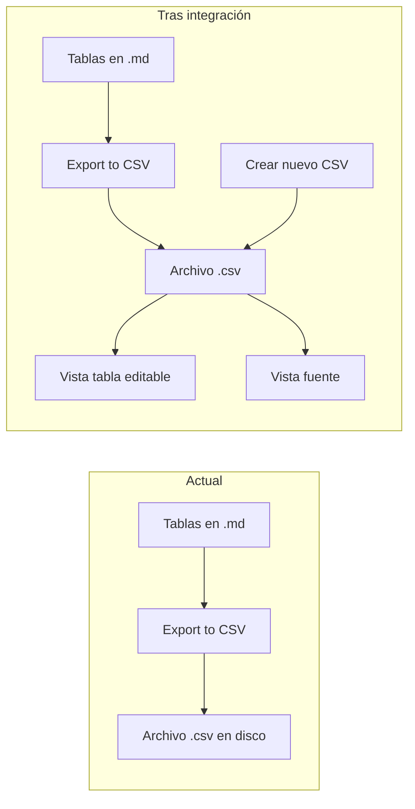

# Integrar csv-lite en Emic Table Tools

## Resumen

Incorporar en [src/main.ts](src/main.ts) el registro de vistas para `.csv`, la lógica de vista tabla editable y vista fuente de [csv-lite](https://github.com/LIUBINfighter/csv-lite), los utils de parsing/guardado, i18n, y la creación de nuevos CSV. Mantener todo el comportamiento actual de Emic (export table to CSV, block-id, transpose) y añadir la opción de abrir el CSV recién exportado en la vista integrada.

## Arquitectura actual vs objetivo

- **Vista tabla** (`VIEW_TYPE_CSV`): `TextFileView` que muestra el CSV como tabla editable (búsqueda, pin columnas, delimitador, undo, etc.).
- **Vista fuente** (`VIEW_TYPE_CSV_SOURCE`): `TextFileView` con CodeMirror para editar el texto bruto; toggle a vista tabla desde el header.
- **Extensión**: registrar `csv` para que al abrir un `.csv` se use la vista tabla por defecto.
- **Crear CSV**: comando en palette + ítem en menú contextual del file explorer (misma lógica que csv-lite: nombre `new.csv` / `new-1.csv` en carpeta elegida, sin modal).

## Estructura de archivos a añadir

Todo bajo `src/`, manteniendo módulos acotados (AGENTS.md):

| Origen csv-lite                                                                  | Destino Emic                                                      |
| -------------------------------------------------------------------------------- | ----------------------------------------------------------------- |
| `utils/csv-utils.ts`                                                             | `src/csv/csv-utils.ts`                                            |
| `utils/file-utils.ts`                                                            | `src/csv/file-utils.ts`                                           |
| `utils/history-manager.ts`                                                       | `src/csv/history-manager.ts`                                      |
| `utils/table-utils.ts`                                                           | `src/csv/table-utils.ts`                                          |
| `utils/highlight-manager.ts`                                                     | `src/csv/highlight-manager.ts`                                    |
| `utils/url-utils.ts`                                                             | `src/csv/url-utils.ts`                                            |
| `view/edit-bar.ts`, `search-bar.ts`, `table-render.ts`, `header-context-menu.ts` | `src/csv/view/edit-bar.ts`, etc.                                  |
| `view.ts`                                                                        | `src/csv/csv-view.ts`                                             |
| `source-view.ts`                                                                 | `src/csv/csv-source-view.ts`                                      |
| `i18n/index.ts`, `en.ts`, `zh-cn.ts`                                             | `src/csv/i18n/index.ts`, `en.ts`, `zh-cn.ts` (+ `es.ts` opcional) |

- **No copiar** `utils/create-csv-modal.ts`: la creación será directa desde `main` (como en csv-lite actual), sin modal.
- **Mantener** [src/utils/csv.ts](src/utils/csv.ts) (`rowsToCsv`) para el modal de export; la vista CSV usará `csv-utils` (parse/unparse/detect delimiter).

## Identificadores de vista

- Usar constantes propias para evitar conflicto si el usuario tuvo csv-lite instalado:
  - `VIEW_TYPE_CSV = "emic-csv-view"`
  - `VIEW_TYPE_CSV_SOURCE = "emic-csv-source-view"`
- Sustituir en todo el código portado las cadenas `"csv-lite-view"` y `"csv-lite-source-view"` por las anteriores (incl. `source-view` donde cambia a vista tabla).

## Cambios en Emic

### 1. [src/main.ts](src/main.ts)

- Importar `CSVView` / `VIEW_TYPE_CSV` y `SourceView` / `VIEW_TYPE_CSV_SOURCE` desde los nuevos módulos.
- Inicializar i18n al cargar (p. ej. con `moment.locale()` como en csv-lite, o detección simple).
- `registerView(VIEW_TYPE_CSV, leaf => new CSVView(leaf))`.
- `registerView(VIEW_TYPE_CSV_SOURCE, leaf => new SourceView(leaf))`.
- `registerExtensions(["csv"], VIEW_TYPE_CSV)`.
- Comando "Create new CSV" que cree archivo en carpeta raíz (o carpeta por defecto de export si se desea) con nombre `new.csv` / `new-1.csv`… y abra el archivo en un leaf (igual que csv-lite).
- Registrar `workspace.on("file-menu", ...)` para añadir ítem "Create new CSV" en el menú del explorador (crear en carpeta del archivo/carpeta seleccionada).
- No eliminar ningún comando ni menú actual de Emic.

### 2. [src/settings.ts](src/settings.ts)

- Añadir a `EmicTableToolsSettings`: `preferredDelimiter?: "auto" | "," | ";" | "\\t"` (opcional, por defecto `"auto"`).
- En la UI del setting tab: nueva opción "Preferred CSV delimiter" (dropdown: Auto, Comma, Semicolon, Tab). La vista CSV leerá esto al abrir (desde `app.plugins.plugins['emic-table-tools'].settings.preferredDelimiter` o pasando el plugin a la vista si se prefiere inyección).
- Opcional pero recomendable: añadir `openCsvAfterExport: boolean` (default `true`) para abrir el CSV recién guardado en la vista integrada.

### 3. [src/ui/csv-export-modal.ts](src/ui/csv-export-modal.ts)

- Tras `vault.create(fullPath, content)`:
  - Obtener el `TFile` creado con `vault.getAbstractFileByPath(fullPath)`.
  - Si `plugin.settings.openCsvAfterExport === true` (y el plugin tiene esa propiedad), abrir el archivo en un leaf: `workspace.getLeaf(true).openFile(createdFile)` (el leaf usará la vista registrada para `csv`).
- Cerrar el modal y notificar como hasta ahora.

### 4. Estilos

- Añadir a [styles.css](styles.css) los estilos de csv-lite (tabla, búsqueda, source view, etc.). Revisar que las clases referenciadas en el código portado coincidan (csv-lite usa por ejemplo `.csv-lite-view`; se pueden renombrar a `.emic-csv-view` si se quiere namespacing, o dejar nombres originales si no chocan con Obsidian).

## i18n

- Portar el sistema i18n de csv-lite: `src/csv/i18n/index.ts` (API `i18n.t(key)`, `setLocale`).
- Locale inicial con `moment.locale()` (Obsidian expone moment).
- Incluir al menos `en` y, si se desea coherencia con el resto del plugin, `es`; opcional `zh-cn`.
- Todas las cadenas visibles de la vista CSV y del comando "Create new CSV" deben salir de i18n.

## Dependencias y build

- **Sin dependencias npm nuevas**: CodeMirror y moment ya están disponibles vía Obsidian (y en [esbuild.config.mjs](esbuild.config.mjs) los `@codemirror/*` y `@lezer/*` están en `external`).
- Entrada sigue siendo `src/main.ts`; los nuevos módulos se importan desde ahí o desde `csv-view`/`csv-source-view`.

## Orden sugerido de implementación

1. **Fase 1 – Utils y CSV core**
  Crear `src/csv/` y portar `csv-utils`, `file-utils`, `history-manager`, `table-utils`, `highlight-manager`, `url-utils`. Ajustar imports entre ellos (rutas a `./csv/...`). No depender de `plugin` en estos módulos.
2. **Fase 2 – i18n**
  Portar `i18n/index.ts`, `en.ts`, `zh-cn.ts` y, si se quiere, `es.ts`. Inicializar locale en `onload` del plugin.
3. **Fase 3 – Subvistas**
  Portar `view/edit-bar.ts`, `view/search-bar.ts`, `view/table-render.ts`, `view/header-context-menu.ts` bajo `src/csv/view/`, actualizando imports a `../csv-utils`, `../history-manager`, etc., y usando `emic-csv-view` / `emic-csv-source-view` donde corresponda.
4. **Fase 4 – Vistas principales**
  Portar `view.ts` → `csv-view.ts` y `source-view.ts` → `csv-source-view.ts` en `src/csv/`, sustituyendo constantes de tipo de vista y referencias a plugin por `emic-table-tools` y a `settings.preferredDelimiter`. Registrar ambas vistas y `registerExtensions(["csv"], VIEW_TYPE_CSV)` en `main.ts`.
5. **Fase 5 – Comandos y menú**
  Implementar en `main.ts` la creación de CSV (comando + file-menu), usando la misma lógica de nombres que csv-lite (`new.csv`, `new-1.csv`, …) y `FileUtils.withRetry` para el create.
6. **Fase 6 – Settings y export**
  Añadir `preferredDelimiter` y `openCsvAfterExport` en settings y en la setting tab. En el modal de export, después de guardar, abrir el archivo si `openCsvAfterExport` está activo.
7. **Fase 7 – Estilos**
  Copiar/adaptar `styles.css` de csv-lite al `styles.css` del plugin y comprobar en claro/oscuro.

## Riesgos y mitigación

- **Tamaño de `view.ts`**: ~1200 líneas. Mantenerlo en un solo archivo está bien si está ya modularizado por componentes (edit-bar, search-bar, table-render, header-context-menu); si en el futuro supera ~300 líneas por responsabilidad, extraer a más módulos bajo `src/csv/view/`.
- **Compatibilidad con csv-lite instalado**: si ambos están activos, dos plugins registrarían la extensión `csv`. Evitable desinstalando csv-lite al usar Emic; los view types distintos (`emic-csv-view` vs `csv-lite-view`) evitan colisión de estado.
- **Licencia**: csv-lite es MIT. Incluir atribución en README o en cabecera de los archivos portados.

## Criterios de aceptación

- Abrir un `.csv` en Obsidian abre la vista tabla (Emic).
- Desde la vista tabla se puede cambiar a vista fuente y volver (botón en header).
- Búsqueda, pin de columnas, cambio de delimitador (solo re-parsing), edición de celdas y guardado funcionan como en csv-lite.
- Comando "Create new CSV" y menú en file explorer crean `new.csv` (o incremental) y abren el archivo.
- Export table to CSV sigue funcionando; si "Open CSV after save" está activo, el archivo se abre en la vista CSV integrada.
- Configuración de delimitador preferido y de "Open CSV after save" se persiste y aplica correctamente.

