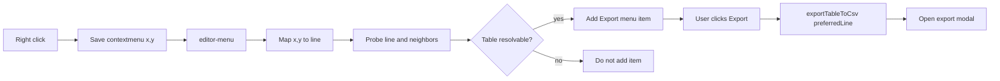

# Conditional visibility for Export menu item

## Objective

Make the editor context menu item appear only when export is actually available, and fix Live Preview inconsistency where click target and source cursor diverge.

## Scope

- Keep command registration and hotkey behavior as-is.
- Change only editor-menu visibility and action resolution.
- Do not make the command always visible globally.

## Files to update

- [src/main.ts](src/main.ts)
- [src/commands/export-table-csv.ts](src/commands/export-table-csv.ts)
- [src/utils/table-detection.ts](src/utils/table-detection.ts)

## Plan

### 1) Add canonical line-based resolver

In [src/utils/table-detection.ts](src/utils/table-detection.ts):

- Add `getTableAtLine(editor, line): TableAtCursor | null`.
- Keep `getTableAtCursor(editor)` as a wrapper over `getTableAtLine(editor, editor.getCursor().line)`.
- Preserve existing behavior:
  - block ID (`^...`) detected if immediately below table,
  - block ID line excluded from exported rows,
  - cursor on block ID resolves the table above.

### 2) Accept preferred line in export action

In [src/commands/export-table-csv.ts](src/commands/export-table-csv.ts):

- Update API to `exportTableToCsv(plugin, preferredLine?: number)`.
- Resolve in order:
  1. `getTableAtLine(editor, preferredLine)` when provided
  2. `getTableAtCursor(editor)`
- If neither resolves: `Notice("No table under click/cursor.")`.

### 3) Capture right-click context

In [src/main.ts](src/main.ts):

- Track latest contextmenu coordinates using `registerDomEvent(document, "contextmenu", ...)`.
- Add helper to map right-click coordinates to an editor line (best-effort CM6 internals if available).
- Add tolerance probing for edge clicks: `line`, `line-1`, `line+1` (optionally `±2`).

### 4) Conditional menu visibility

In `editor-menu` callback in [src/main.ts](src/main.ts):

- Compute candidate line from last right-click mapping.
- Determine availability by trying:
  1. table at candidate line,
  2. table at cursor.
- Only if available, add menu item `Export table to CSV`.
- Menu action passes preferred/resolved line to `exportTableToCsv(...)` to avoid cursor drift.

### 5) Validation

- Live Preview right-click inside table (start/end of cell) shows item consistently.
- Right-click on block ID line after table shows item.
- Right-click outside table hides item.
- Export output excludes block ID row and keeps filename rules.
- Command palette behavior remains unchanged.

## Data flow

