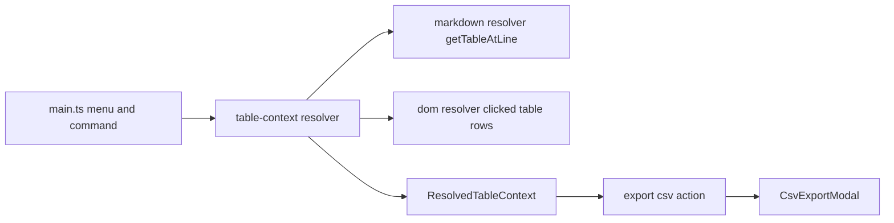

# Refactor for reuse and optimization

## Goal

Stabilize and simplify future table features by extracting a shared table-context resolver and action layer, while preserving current behavior (including Live Preview DOM fallback and conditional menu visibility).

## Why refactor now

Current logic is spread between [src/main.ts](src/main.ts), [src/commands/export-table-csv.ts](src/commands/export-table-csv.ts), and [src/utils/table-detection.ts](src/utils/table-detection.ts). This works, but adding new table features would duplicate:

- right-click context capture,
- line mapping fallbacks (CM6/CM5/DOM),
- markdown vs DOM table resolution,
- export action branching.

## Target architecture

## Files to add

- [src/types.ts](src/types.ts)
  - `ResolvedTableContext` type:
    - `source: "markdown" | "dom"`
    - `rows: string[][]`
    - `blockId: string | null`
    - `preferredLine?: number`
- [src/table-context/resolver.ts](src/table-context/resolver.ts)
  - Encapsulates right-click capture model + resolve methods.
  - Public methods:
    - `setContextMenuEvent(evt: MouseEvent): void`
    - `resolveForEditorMenu(editor): ResolvedTableContext | null`
    - `resolveForCommand(editor): ResolvedTableContext | null`
- [src/table-context/dom-table.ts](src/table-context/dom-table.ts)
  - `extractRowsFromTableTarget(target: Element | null): string[][] | null`
- [src/table-context/editor-position.ts](src/table-context/editor-position.ts)
  - `mapTargetToLine(...)`
  - `mapLineElementAtPointToLine(...)`
  - `mapCoordsToLine(...)`
  - `probeCoordLines(...)`
- [src/table-actions/export-csv.ts](src/table-actions/export-csv.ts)
  - Single action API that takes `ResolvedTableContext` + plugin + active view and opens CSV modal.

## Files to refactor

- [src/main.ts](src/main.ts)
  - Keep only orchestration:
    - register command/menu,
    - feed contextmenu events into resolver,
    - ask resolver for context,
    - invoke export action.
  - Remove private mapping/extraction helpers from class.
- [src/commands/export-table-csv.ts](src/commands/export-table-csv.ts)
  - Replace separate `exportTableToCsv`/`exportRowsToCsv` branching with a context-driven call to export action.
- [src/utils/table-detection.ts](src/utils/table-detection.ts)
  - Keep markdown parser APIs only (`getTableAtLine`, `getTableAtCursor`, `cursorIsInTable`).
  - No UI/DOM logic in this file.

## Migration steps

1. Introduce `ResolvedTableContext` type in [src/types.ts](src/types.ts).
2. Move DOM row extraction from [src/main.ts](src/main.ts) into [src/table-context/dom-table.ts](src/table-context/dom-table.ts).
3. Move CM mapping helpers from `main.ts` into [src/table-context/editor-position.ts](src/table-context/editor-position.ts).
4. Create [src/table-context/resolver.ts](src/table-context/resolver.ts) that:
  - stores latest contextmenu event snapshot,
  - resolves markdown context first for precise line hits,
  - falls back to DOM table rows when source mapping fails.
5. Create [src/table-actions/export-csv.ts](src/table-actions/export-csv.ts) with one entrypoint:
  - takes `ResolvedTableContext`, `plugin`, `view` and opens `CsvExportModal`.
6. Simplify [src/main.ts](src/main.ts) and [src/commands/export-table-csv.ts](src/commands/export-table-csv.ts) to use resolver + action.
7. Keep behavior parity checks:
  - conditional menu visibility,
  - Live Preview edge click cases,
  - command behavior unchanged,
  - filename/block ID behavior preserved.

## Validation checklist

- Right-click in table (any cell area) shows export option consistently.
- Right-click outside table hides option.
- Command palette still works from table context.
- Exported CSV content unchanged (no block ID row, header toggle still works).
- Save-to-file naming behavior unchanged.
- `npm run build` and lints pass.

## Notes on scope control

- This refactor is structural only (no user-facing feature changes).
- Keep existing class/file names where possible to avoid broad churn.
- Remove old helper code only after new resolver is wired and verified.

