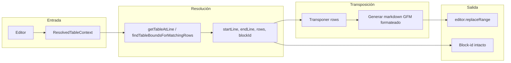

# Plan: Transponer Tabla

## Objetivo

Implementar la acción **Transponer Tabla** que:

- Transpone la tabla (filas ↔ columnas) usando solo código del proyecto.
- **Preserva el block-id** de la tabla (no se modifica la línea `^id` que queda debajo).
- Genera una tabla GFM **correctamente formateada** (columnas alineadas).
- Nombre visible: "Transponer Tabla".
- Disponible desde el menú contextual **Table Tools** y desde la paleta de comandos cuando el cursor está en una tabla.

## Flujo de datos

- El **block-id se preserva** porque el rango que se reemplaza es solo de `startLine` a `endLine` (las líneas de la tabla). La línea del block-id está en `endLine + 1` (o más abajo) y no se toca.

## Archivos a crear o modificar

### 1. Nuevo: [src/commands/transpose-table.ts](src/commands/transpose-table.ts)

- `**transposeTable(plugin, resolver, context?: ResolvedTableContext)`**: misma firma y patrón que [assign-table-block-id.ts](src/commands/assign-table-block-id.ts).
  - Obtener vista activa y resolver contexto: `context ?? resolver.resolveForCommand(view.editor)`; si no hay tabla, `Notice("No table under click/cursor.")` y return.
  - Obtener límites con `getTableAtLine(editor, resolved.preferredLine)` si `preferredLine` está definido, si no con `findTableBoundsForMatchingRows(editor, resolved.rows)`. Si no hay resultado, mismo Notice y return.
  - Transponer `result.rows`: para cada columna `j` (0..maxCols-1), crear fila `transposedRow[j] = rows[i][j] ?? ""` con `maxCols = Math.max(...rows.map(r => r.length))`. Resultado: `string[][]` transpuesto.
  - Generar markdown GFM formateado a partir de `string[][]`:
    - Primera fila = header; segunda línea = separador `|---|...`; resto = filas de datos.
    - Formato consistente: por cada columna, calcular ancho = `max(cell.length)` en esa columna; escribir cada celda rellenada con espacios (o al menos `| cell |` con un espacio). Así la tabla queda alineada y válida en GFM.
  - Reemplazar en el editor: `from = { line: startLine, ch: 0 }`, `to = { line: endLine, ch: editor.getLine(endLine).length }`, `editor.replaceRange(newTableText, from, to)`.
  - Opcional: `new Notice("Tabla transpuesta.")`.
- Helpers en el mismo archivo (o en un pequeño módulo interno):
  - `**transposeMatrix(rows: string[][]): string[][]`**: devuelve la matriz transpuesta, rellenando celdas faltantes con `""` según `maxCols`.
  - `**rowsToGFMTable(rows: string[][]): string**`: convierte `rows` (header + body) en una sola string con líneas separadas por `\n`: línea de header, línea separadora, líneas de datos; con columnas alineadas al ancho máximo por columna.

### 2. Modificar: [src/main.ts](src/main.ts)

- Importar `transposeTable` desde `./commands/transpose-table`.
- Añadir comando con `addCommand`:
  - `id`: `"transpose-table"`.
  - `name`: `"Transponer Tabla"`.
  - `editorCheckCallback`: si `checking` devolver `cursorIsInTable(editor)`; si no, llamar `transposeTable(this, this.tableContextResolver)` y devolver `undefined`.
- En el manejador de `editor-menu`, dentro del submenú "Table Tools", añadir un nuevo `submenu.addItem`:
  - `setTitle("Transponer Tabla")`.
  - `onClick(() => transposeTable(this, this.tableContextResolver, context))`.

Orden sugerido en el submenú: mantener "Export table to CSV" y "Asignar block-id a esta tabla", y añadir "Transponer Tabla" (por ejemplo después de "Asignar block-id...").

## Detalles de implementación

- **Tablas irregulares**: si alguna fila tiene menos celdas, usar `rows[i][j] ?? ""` al transponer para no dejar huecos indefinidos.
- **Tabla vacía o de una sola celda**: validar `rows.length` y que tras transponer haya al menos una fila; si no, no reemplazar y opcionalmente avisar.
- **Separador GFM**: usar `|---|` (o `| --- |` con espacios) por columna; no es necesario replicar `:---` del original para la primera implementación.
- **Block-id**: no incluir la línea del block-id en el texto a insertar; el reemplazo solo cubre de `startLine` a `endLine`, por lo que la línea `^id` que está debajo se mantiene automáticamente.

## Resumen de tareas

| Tarea              | Descripción                                                                                                                                                           |
| ------------------ | --------------------------------------------------------------------------------------------------------------------------------------------------------------------- |
| transpose-table.ts | Crear módulo con `transposeTable`, `transposeMatrix` y `rowsToGFMTable`; resolver contexto, obtener bounds, transponer, formatear y reemplazar sin tocar el block-id. |
| main.ts            | Registrar comando "Transponer Tabla" y añadir ítem al submenú Table Tools.                                                                                            |

